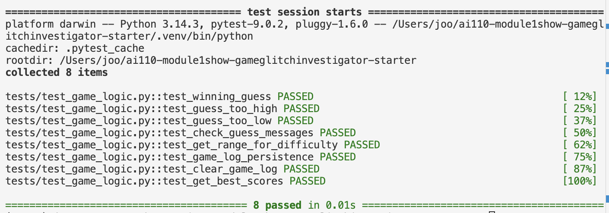

# 🎮 Game Glitch Investigator: The Impossible Guesser

## 🚨 The Situation

You asked an AI to build a simple "Number Guessing Game" using Streamlit.
It wrote the code, ran away, and now the game is unplayable.

- You can't win.
- The hints lie to you.
- The secret number seems to have commitment issues.

## 🛠️ Setup

1. Install dependencies: `pip install -r requirements.txt`
2. Run the broken app: `python -m streamlit run app.py`

## 🕵️‍♂️ Your Mission

1. **Play the game.** Open the "Developer Debug Info" tab in the app to see the secret number. Try to win.
2. **Find the State Bug.** Why does the secret number change every time you click "Submit"? Ask ChatGPT: *"How do I keep a variable from resetting in Streamlit when I click a button?"*
3. **Fix the Logic.** The hints ("Higher/Lower") are wrong. Fix them.
4. **Refactor & Test.** - Move the logic into `logic_utils.py`.
   - Run `pytest` in your terminal.
   - Keep fixing until all tests pass!

## 📝 Document Your Experience

- **Describe the game's purpose.**
  The game is a number guessing game where players try to guess a secret number within a range based on the selected difficulty (Easy: 1-20, Normal: 1-100, Hard: 1-50). It provides hints ("Too High" or "Too Low") to guide guesses, tracks attempts, and awards points based on performance. The goal is to guess correctly within the attempt limit.

- **Detail which bugs you found.**
  1. The secret number could be outside the selected difficulty range (e.g., new games always used 1-100 regardless of difficulty).
  2. The hint messages were swapped: "Too High" said "Go HIGHER!" (should be "Go LOWER!"), and "Too Low" said "Go LOWER!" (should be "Go HIGHER!").
  3. The instruction text always showed "1 and 100" instead of the dynamic range.
  4. Attempts counter started inconsistently (1 initially, 0 on new game).
  5. Hard mode had a smaller range than Normal, making it easier despite the name.
  6. Core logic was mixed with UI code in app.py.

- **Explain what fixes you applied.**
  - Refactored core functions (get_range_for_difficulty, parse_guess, check_guess, update_score) from app.py to logic_utils.py for better separation.
  - Fixed bug #1: Updated new game logic to use random.randint(low, high) based on difficulty.
  - Fixed bug #4: Swapped hint messages in check_guess for correct guidance.
  - Updated instruction text to display dynamic range ({low} and {high}).
  - Added FIXME and FIX comments documenting AI collaboration.
  - Updated and added tests in test_game_logic.py to verify messages and ranges.
  - Documented the process in reflection.md.

## 📸 Demo

The game now runs correctly with proper hints and difficulty ranges. For example:
- Select "Easy" mode: Range is 1-20, attempts allowed: 6.
- Guess incorrectly: Get accurate hints like "📉 Go LOWER!" for too high guesses.
- Win the game: See balloons, success message, and score calculation.
- Start a new game: Secret respects the difficulty range.
- See recent results in the sidebar: each completed game (win/loss) is saved to a local log file and shown in the UI.

> Screenshot shows the terminal output from running `pytest tests/test_game_logic.py -v` with all tests passing, and the Streamlit UI showing correct range display, hint messages, and a sidebar game log.

(Place a screenshot named `pytest-results.png` in the repo root and it will render here.)

## 🚀 Stretch Features

- [x] Added a **recent games log** sidebar that saves the last 10 completed games to `game_log.json` (win/loss, score, attempts, difficulty, timestamp).
- [x] Add a **Clear history** button to wipe the saved game log.
- [x] Add a **Best score** summary per difficulty (determines the best score and tie-breaks on fewer attempts).
